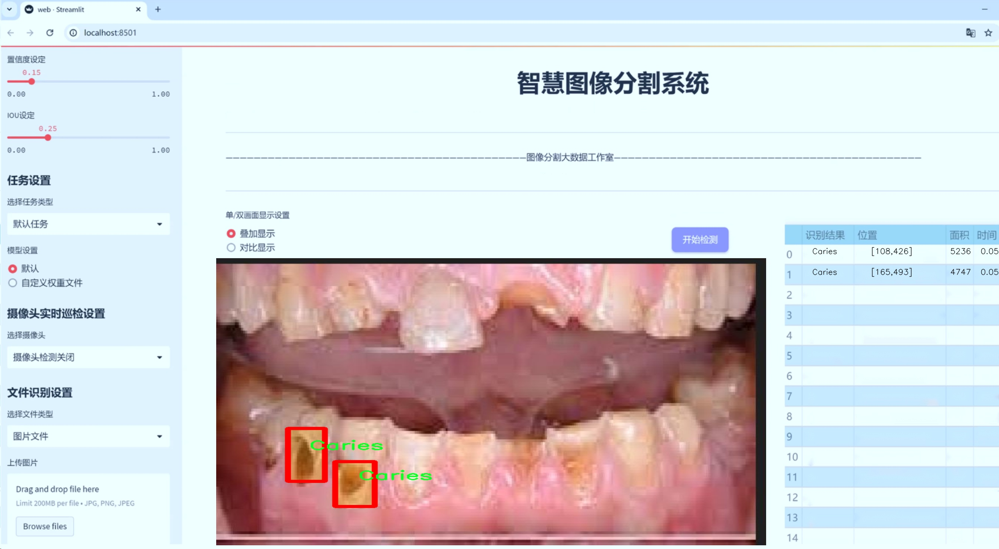
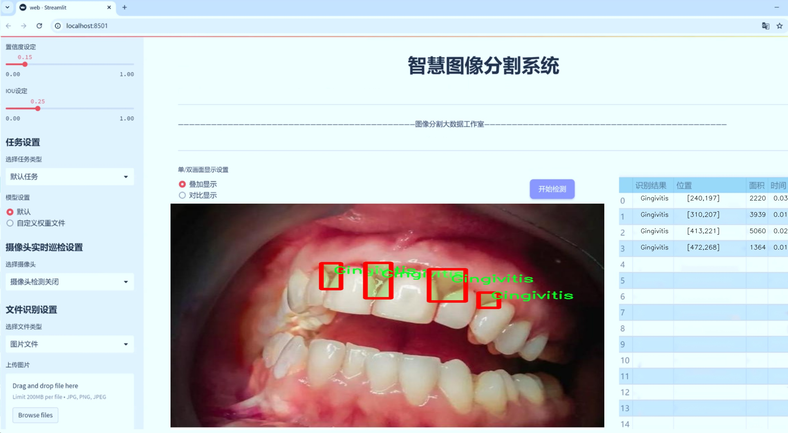
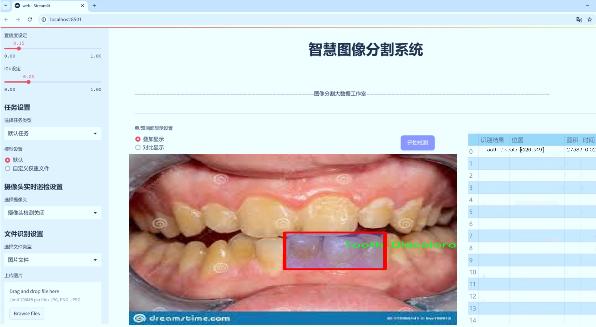
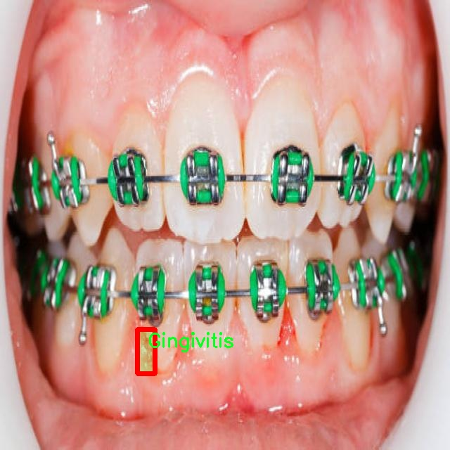
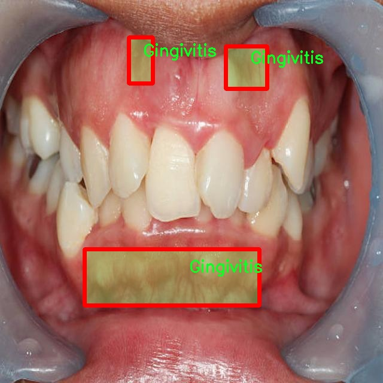
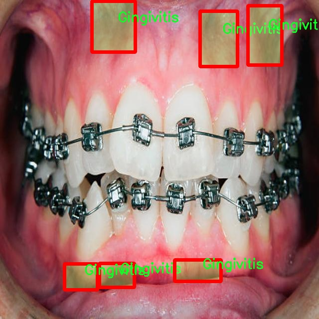
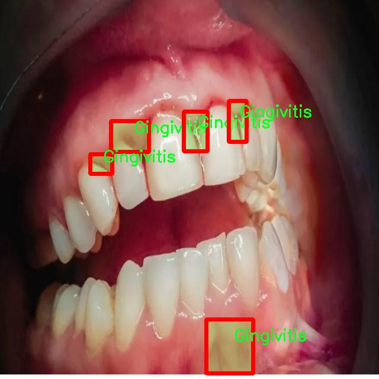
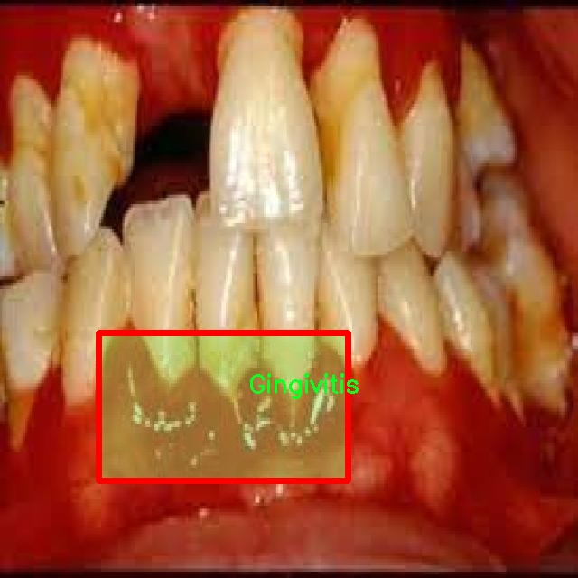

# 口腔疾病图像分割系统： yolov8-seg

### 1.研究背景与意义

[参考博客](https://gitee.com/YOLOv8_YOLOv11_Segmentation_Studio/projects)

[博客来源](https://kdocs.cn/l/cszuIiCKVNis)

研究背景与意义

口腔健康是人类整体健康的重要组成部分，口腔疾病的早期诊断与治疗对于提高生活质量、降低医疗成本具有重要意义。随着数字化技术的快速发展，医学影像在口腔疾病的诊断中扮演着越来越重要的角色。传统的口腔疾病诊断方法往往依赖于医生的经验和主观判断，容易受到人为因素的影响，导致诊断结果的准确性和一致性不足。因此，开发一种高效、准确的口腔疾病图像分割系统显得尤为重要。

近年来，深度学习技术在计算机视觉领域取得了显著进展，尤其是目标检测和图像分割方面的应用，极大地推动了医学影像分析的发展。YOLO（You Only Look Once）系列模型因其高效的实时处理能力和优越的检测精度，成为了目标检测领域的热门选择。YOLOv8作为该系列的最新版本，结合了更为先进的网络结构和算法优化，具备了更强的特征提取能力和更快的推理速度，适合用于复杂的医学图像分割任务。

本研究旨在基于改进的YOLOv8模型，构建一个口腔疾病图像分割系统，专注于四种常见的口腔疾病：龋齿、牙龈炎、牙齿变色和口腔溃疡。通过对1400幅标注图像的训练，系统将能够自动识别和分割这些疾病的相关特征区域，从而为临床医生提供更为精准的辅助诊断工具。该数据集涵盖了多种口腔疾病的不同表现形式，具有较高的代表性和实用价值，为模型的训练和验证提供了良好的基础。

在实际应用中，口腔疾病的早期发现和及时处理对于预防疾病的进一步发展至关重要。通过实现自动化的图像分割，医生可以更快地获取疾病信息，制定个性化的治疗方案。此外，系统的推广应用还将为口腔医学教育提供有力支持，帮助学生和年轻医生更好地理解和识别口腔疾病的特征。

综上所述，基于改进YOLOv8的口腔疾病图像分割系统的研究不仅具有重要的学术价值，还具备广泛的临床应用前景。通过提升口腔疾病的诊断效率和准确性，能够有效改善患者的治疗体验，降低医疗资源的浪费，为推动口腔健康事业的发展贡献力量。同时，该研究也为深度学习技术在医学影像分析中的应用提供了新的思路和方法，具有重要的理论意义和实践价值。

### 2.图片演示







注意：本项目提供完整的训练源码数据集和训练教程,由于此博客编辑较早,暂不提供权重文件（best.pt）,需要按照6.训练教程进行训练后实现上图效果。

### 3.视频演示

[3.1 视频演示](https://www.bilibili.com/video/BV1ETmRYCEdd/)

### 4.数据集信息

##### 4.1 数据集类别数＆类别名

nc: 4
names: ['Caries', 'Gingivitis', 'Tooth Discoloration', 'Ulcer']


##### 4.2 数据集信息简介

数据集信息展示

在本研究中，我们使用了名为“unbeknownst to man”的数据集，旨在改进YOLOv8-seg的口腔疾病图像分割系统。该数据集专注于口腔健康领域，涵盖了四种主要的口腔疾病类别，分别是龋齿（Caries）、牙龈炎（Gingivitis）、牙齿变色（Tooth Discoloration）和溃疡（Ulcer）。这些类别的选择不仅反映了口腔疾病的多样性，也为我们提供了一个全面的视角，以便更好地理解和分析这些疾病的表现形式及其在图像中的特征。

数据集中的每个类别都包含大量高质量的图像，这些图像经过精心标注，确保了每个样本的准确性和一致性。龋齿作为最常见的口腔疾病之一，其图像展示了不同阶段的龋齿发展，从初期的微小白斑到严重的牙体损坏，图像中清晰的细节为模型训练提供了丰富的信息。牙龈炎则通过展示红肿、出血等症状，帮助模型学习如何识别和分割出受影响的牙龈区域。牙齿变色的图像则展示了因多种因素导致的牙齿色泽变化，这些变化可能是由于饮食、生活习惯或口腔卫生不良等原因引起的。最后，溃疡的图像则提供了对口腔内病变的直观表现，通常伴随着疼痛和不适，这类图像的标注对于识别和分割至关重要。

该数据集的构建过程遵循严格的标准，确保每个类别的样本均衡，且具有代表性。这种多样性使得模型在训练过程中能够学习到不同口腔疾病的特征，进而提高其在实际应用中的准确性和鲁棒性。此外，数据集还包含了不同年龄段、性别和种族的患者样本，这种多样性不仅增强了模型的泛化能力，也为未来的临床应用提供了更广泛的适用性。

在数据集的使用过程中，我们采用了数据增强技术，以进一步提高模型的性能。通过旋转、缩放、翻转等方式，我们能够生成更多的训练样本，从而丰富模型的学习经验。这种方法不仅能够减少过拟合的风险，还能提高模型在面对真实世界中复杂多变的口腔图像时的适应能力。

总之，“unbeknownst to man”数据集为我们改进YOLOv8-seg的口腔疾病图像分割系统提供了坚实的基础。通过对龋齿、牙龈炎、牙齿变色和溃疡等四种口腔疾病的深入研究，我们期望能够提升图像分割的准确性和效率，为口腔健康的早期诊断和治疗提供有力支持。随着技术的不断进步和数据集的不断完善，我们相信，这一研究将为口腔医学领域带来新的突破和发展。











### 5.项目依赖环境部署教程（零基础手把手教学）

[5.1 环境部署教程链接（零基础手把手教学）](https://www.bilibili.com/video/BV1jG4Ve4E9t/?vd_source=bc9aec86d164b67a7004b996143742dc)


[5.2 安装Python虚拟环境创建和依赖库安装视频教程链接（零基础手把手教学）](https://www.bilibili.com/video/BV1nA4VeYEze/?vd_source=bc9aec86d164b67a7004b996143742dc)

### 6.手把手YOLOV8-seg训练视频教程（零基础手把手教学）

[6.1 手把手YOLOV8-seg训练视频教程（零基础小白有手就能学会）](https://www.bilibili.com/video/BV1cA4VeYETe/?vd_source=bc9aec86d164b67a7004b996143742dc)


按照上面的训练视频教程链接加载项目提供的数据集，运行train.py即可开始训练



     Epoch   gpu_mem       box       obj       cls    labels  img_size
     1/200     0G   0.01576   0.01955  0.007536        22      1280: 100%|██████████| 849/849 [14:42<00:00,  1.04s/it]
               Class     Images     Labels          P          R     mAP@.5 mAP@.5:.95: 100%|██████████| 213/213 [01:14<00:00,  2.87it/s]
                 all       3395      17314      0.994      0.957      0.0957      0.0843

     Epoch   gpu_mem       box       obj       cls    labels  img_size
     2/200     0G   0.01578   0.01923  0.007006        22      1280: 100%|██████████| 849/849 [14:44<00:00,  1.04s/it]
               Class     Images     Labels          P          R     mAP@.5 mAP@.5:.95: 100%|██████████| 213/213 [01:12<00:00,  2.95it/s]
                 all       3395      17314      0.996      0.956      0.0957      0.0845

     Epoch   gpu_mem       box       obj       cls    labels  img_size
     3/200     0G   0.01561    0.0191  0.006895        27      1280: 100%|██████████| 849/849 [10:56<00:00,  1.29it/s]
               Class     Images     Labels          P          R     mAP@.5 mAP@.5:.95: 100%|███████   | 187/213 [00:52<00:00,  4.04it/s]
                 all       3395      17314      0.996      0.957      0.0957      0.0845


### 7.50+种全套YOLOV8-seg创新点加载调参实验视频教程（一键加载写好的改进模型的配置文件）

[7.1 50+种全套YOLOV8-seg创新点加载调参实验视频教程（一键加载写好的改进模型的配置文件）](https://www.bilibili.com/video/BV1Hw4VePEXv/?vd_source=bc9aec86d164b67a7004b996143742dc)

### YOLOV8-seg算法简介

原始YOLOV8-seg算法原理

YOLOv8-seg是YOLO系列的最新版本，代表了目标检测和分割领域的前沿技术。与之前的YOLOv5相比，YOLOv8在检测精度和速度上都取得了显著的提升，成为了当今计算机视觉任务中的一个重要工具。YOLOv8的设计不仅关注于目标检测，还扩展到了实例分割，这使得它在处理复杂场景时具有更强的能力。

YOLOv8的网络结构可以分为四个主要部分：输入端、骨干网络、颈部网络和头部网络。输入端的设计采用了马赛克数据增强技术，这种方法通过将多张图像拼接在一起，增加了训练数据的多样性，从而提高了模型的鲁棒性。此外，YOLOv8还引入了自适应锚框计算和自适应灰度填充，以适应不同的输入图像特征和大小。这些创新的输入处理方法为后续的特征提取和处理奠定了坚实的基础。

在骨干网络部分，YOLOv8采用了Conv.C2f和SPPF（Spatial Pyramid Pooling Fusion）结构。C2f模块是YOLOv8的核心特征提取模块，它通过多分支的跨层连接，显著增强了模型的梯度流动性，从而提高了特征表示能力。这种设计灵感来源于YOLOv7的ELAN结构，旨在通过丰富的特征学习来提升模型的整体性能。同时，SPPF结构则通过空间金字塔池化技术，进一步增强了模型对不同尺度目标的感知能力，使得YOLOv8在处理多尺度目标时表现得更加出色。

颈部网络采用了路径聚合网络（PAN）结构，这一设计使得YOLOv8能够有效地融合来自不同层次的特征信息。通过这种特征融合，模型能够更好地捕捉到目标的细节信息，从而提高了检测的准确性和分割的精度。尤其是在处理复杂背景和重叠目标时，PAN结构展现出了其独特的优势。

头部网络是YOLOv8的另一个重要创新点。与以往版本不同，YOLOv8将分类和检测过程进行了有效的解耦，采用了三个独立的解耦头。这种设计不仅提高了模型的灵活性，还加速了推理过程。头部网络的损失计算采用了Task-Aligned Assigner策略，通过根据分类与回归的分数加权结果来选择正样本，从而提高了训练效率和模型的收敛速度。在损失计算方面，YOLOv8结合了二元交叉熵损失（BCELoss）和分布焦点损失（DFLoss），同时引入了完全交并比损失函数（CIOULoss），以进一步提升边界框预测的准确性。

YOLOv8的设计还考虑到了模型的轻量化和实时性。通过调整不同尺度模型的通道数和深度，YOLOv8在保证检测精度的同时，显著减少了模型的参数量。这使得YOLOv8n版本成为了参数量最小且检测速度最快的选择，适合于对实时性要求较高的应用场景。此外，YOLOv8还引入了无锚框检测头，减少了锚框预测的数量，从而加速了非最大抑制（NMS）过程，进一步提升了推理速度。

YOLOv8-seg的应用场景非常广泛，包括自动驾驶、安防监控、医学影像分析等领域。它不仅能够实现高效的目标检测，还能对目标进行精确的分割，提供更为细致的视觉信息。在实际应用中，YOLOv8-seg展现出了极高的灵活性和适应性，能够处理各种复杂的视觉任务。

综上所述，YOLOv8-seg算法通过其创新的网络结构和高效的特征处理方法，成功地在目标检测和分割领域中树立了新的标杆。其出色的性能和广泛的应用前景，使得YOLOv8-seg成为了计算机视觉研究和应用中的一颗璀璨明珠。随着技术的不断进步，YOLOv8-seg无疑将在未来的视觉智能领域中发挥更加重要的作用。


### 9.系统功能展示（检测对象为举例，实际内容以本项目数据集为准）

图9.1.系统支持检测结果表格显示

  图9.2.系统支持置信度和IOU阈值手动调节

  图9.3.系统支持自定义加载权重文件best.pt(需要你通过步骤5中训练获得)

  图9.4.系统支持摄像头实时识别

  图9.5.系统支持图片识别

  图9.6.系统支持视频识别

  图9.7.系统支持识别结果文件自动保存

  图9.8.系统支持Excel导出检测结果数据


### 10.50+种全套YOLOV8-seg创新点原理讲解（非科班也可以轻松写刊发刊，V11版本正在科研待更新）

#### 10.1 由于篇幅限制，每个创新点的具体原理讲解就不一一展开，具体见下列网址中的创新点对应子项目的技术原理博客网址【Blog】：


[10.1 50+种全套YOLOV8-seg创新点原理讲解链接](https://gitee.com/qunmasj/good)

#### 10.2 部分改进模块原理讲解(完整的改进原理见上图和技术博客链接)【如果此小节的图加载失败可以通过CSDN或者Github搜索该博客的标题访问原始博客，原始博客图片显示正常】
### YOLOv8模型原理

YOLOv8是YOLO系列最新的模型,具有非常优秀的检测精度和速度。根据网络的深度与特征图的宽度大小, YOLOv8算法分为:YOLOv8-n、YOLOv8一s 、YOLOv8-m 、 YOLOv8-l、和 YOLOv8-x 5个版本。按照网络结构图,YOLOv8可分为: Inpul 、 Backbone , Neck和Head 4部分。


Backbone采用了CSPDarknet 架构，由CBS (标准卷积层)、C2f模块和 SPPF(金字塔池化）组成。通过5次标准卷积层和C2f模块逐步提取图像特征，并在网络末尾添加SPPF模块，将任意大小的输入图像转换成固定大小的特征向量。分别取P3、P4、P5层的特征提取结果，向Head输出80×80、40 × 40、20×20三个尺度的特征层。
C2f模块借鉴了残差网络(ResNet)以及ELAN的思想，其结构分为两个分支，主干部分利用Bottleneckm2%模块逐步加深网络，分支部分保留输入层通道并与主干部分特征进行融合，如图所示。通过标准卷积层提取新的特征层，相比于YOLOv5使用的C3模块，C2f模块可以在卷积层和全连接层之间建立一个平滑的转换，从而实现了参数的共享，提高了模型的效率和泛化能力。
Head采用了PAN-FPN 结构,将 Backbone输入的3个特征层进行多尺度融合，进行自顶向下(FAN)和自底向上 (PAN)的特征传递，对金字塔进行增强，使不同尺寸的特征图都包含强目标语义信息和强目标特征信息，保证了对不同尺寸样本的准确预测。
Detect借鉴了Decoupled-Head 思想，用一个解耦检测头将输入的不同尺寸特征层分成2个分支进行检测。第1个分支在进行3次卷积后使进行回归任务，输出预测框。第2个分支在进行3次卷积后进行分类任务，输出类别的概率。采用Varifocal_Loss2”作为损失函数，其式为:


### Context_Grided_Network(CGNet)简介
参考该博客提出的一种轻量化语义分割模型Context Grided Network(CGNet)，以满足设备的运行需要。

CGNet主要由CG块构建而成，CG块可以学习局部特征和周围环境上下文的联合特征，最后通过引入全局上下文特征进一步改善联合特征的学习。


 
下图给出了在Cityscapes数据集上对现有的一些语义分割模型的测试效果，横轴表示参数量，纵轴表示准确率(mIoU)。可以看出，在参数量较少的情况下，CGNet可以达到一个比较好的准确率。虽与高精度模型相去甚远，但在一些对精度要求不高、对实时性要求比较苛刻的情况下，很有价值。


高精度模型，如DeepLab、DFN、DenseASPP等，动不动就是几十M的参数，很难应用在移动设备上。而上图中红色的模型，相对内存占用较小，但它们的分割精度却不是很高。作者认为主要原因是，这些小网络大多遵循着分类网络的设计思路，并没有考虑语义分割任务更深层次的特点。

空间依赖性和上下文信息对提高分割精度有很大的作用。作者从该角度出发，提出了CG block，并进一步搭建了轻量级语义分割网络CGNet。CG块具有以下特点： 

学习局部特征和上下文特征的联合特征；
通过全局上下文特征改进上述联合特征；
可以贯穿应用在整个网络中，从low level（空间级别）到high level（语义级别）。不像PSPNet、DFN、DenseASPP等，只在编码阶段以后捕捉上下文特征。；
只有3个下采样，相比一般5个下采样的网络，能够更好地保留边缘信息。
CGNet遵循“深而薄”的原则设计，整个网络又51层构成。其中，为了降低计算，大量使用了channel-wise conv.

小型语义分割模型：

需要平衡准确率和系统开销
进化路线：ENet -> ICNet -> ESPNet
这些模型基本都基于分类网络设计，在分割准确率上效果并不是很好
上下文信息模型：

大多数现有模型只考虑解码阶段的上下文信息并且没有利用周围的上下文信息
注意力机制：

CG block使用全局上下文信息计算权重向量，并使用其细化局部特征和周围上下文特征的联合特征

#### Context Guided Block
CG block由4部分组成：


此外，CG block还采用了残差学习。文中提出了局部残差学习（LRL）和全局残差学习（GRL）两种方式。 LRL添加了从输入到联合特征提取器的连接，GRL添加了从输入到全局特征提取器的连接。从直观上来说，GRL比LRL更能促进网络中的信息传递（更像ResNet~~），后面实验部分也进行了测试，的确GRL更能提升分割精度。


CGNet的通用网络结构如下图所示，分为3个stage，第一个stage使用3个卷积层抽取特征，第二和第三个stage堆叠一定数量的CG block，具体个数可以根据情况调整。最后，通过1x1 conv得到分割结果。


下图是用于Cityscapes数据集的CGNet网络细节说明：输入尺寸为3*680*680；stage1连续使用了3个Conv-BN-PReLU组合，首个组合使用了stride=2的卷积，所以得到了1/2分辨率的feature map；stage2和stage3分别使用了多个CG block，且其中使用了不同大小的膨胀卷积核，最终分别得到了1/4和1/8的feature map。

需注意：

stage2&3的输入特征分别由其上一个stage的首个和最后一个block组合给出（参考上图的绿色箭头）；

输入注入机制，图中未体现，实际使用中，作者还将输入图像下采样1/4或1/8，分别给到stage2和stage3的输入中 ，以进一步加强特征传递。

channel-wise conv。为了缩减参数数量，在局部特征提取器和周围上下文特征提取器中使用了channel-wise卷积，可以消除跨通道的计算成本，同时节省内存占用。但是，没有像MobileNet等模型一样，在depth-wise卷积后面接point-wise卷积（1*1 conv），作者解释是，因为CG block需要保持局部特征和周围上下文特征的独立性，而1*1 conv会破坏这种独立性，所以效果欠佳，实验部分也进行了验证。

个人感觉此处应该指的是depth-wise卷积？

官方Git中对该部分的实现如下：


### 11.项目核心源码讲解（再也不用担心看不懂代码逻辑）

#### 11.1 ultralytics\models\yolo\segment\train.py

以下是经过简化和注释的核心代码部分，保留了SegmentationTrainer类的主要功能，并对每个方法进行了详细的中文注释：

```python
# 引入必要的库和模块
from copy import copy
from ultralytics.models import yolo
from ultralytics.nn.tasks import SegmentationModel
from ultralytics.utils import DEFAULT_CFG, RANK
from ultralytics.utils.plotting import plot_images, plot_results

class SegmentationTrainer(yolo.detect.DetectionTrainer):
    """
    扩展DetectionTrainer类，用于基于分割模型的训练。
    示例用法：
        ```python
        from ultralytics.models.yolo.segment import SegmentationTrainer

        args = dict(model='yolov8n-seg.pt', data='coco8-seg.yaml', epochs=3)
        trainer = SegmentationTrainer(overrides=args)
        trainer.train()
        ```
    """

    def __init__(self, cfg=DEFAULT_CFG, overrides=None, _callbacks=None):
        """初始化SegmentationTrainer对象，接受配置和重写参数。"""
        if overrides is None:
            overrides = {}
        overrides['task'] = 'segment'  # 设置任务类型为分割
        super().__init__(cfg, overrides, _callbacks)  # 调用父类构造函数

    def get_model(self, cfg=None, weights=None, verbose=True):
        """返回使用指定配置和权重初始化的SegmentationModel模型。"""
        # 创建分割模型实例
        model = SegmentationModel(cfg, ch=3, nc=self.data['nc'], verbose=verbose and RANK == -1)
        if weights:
            model.load(weights)  # 如果提供权重，则加载权重

        return model  # 返回模型实例

    def get_validator(self):
        """返回用于YOLO模型验证的SegmentationValidator实例。"""
        self.loss_names = 'box_loss', 'seg_loss', 'cls_loss', 'dfl_loss'  # 定义损失名称
        # 创建并返回分割验证器实例
        return yolo.segment.SegmentationValidator(self.test_loader, save_dir=self.save_dir, args=copy(self.args))

    def plot_training_samples(self, batch, ni):
        """创建带有标签和边框坐标的训练样本图像的绘图。"""
        plot_images(batch['img'],  # 训练图像
                    batch['batch_idx'],  # 批次索引
                    batch['cls'].squeeze(-1),  # 类别标签
                    batch['bboxes'],  # 边框坐标
                    batch['masks'],  # 掩码
                    paths=batch['im_file'],  # 图像文件路径
                    fname=self.save_dir / f'train_batch{ni}.jpg',  # 保存图像的文件名
                    on_plot=self.on_plot)  # 是否在绘图时显示

    def plot_metrics(self):
        """绘制训练和验证指标。"""
        plot_results(file=self.csv, segment=True, on_plot=self.on_plot)  # 保存结果图像
```

### 代码核心部分说明：
1. **SegmentationTrainer类**：继承自DetectionTrainer，专门用于处理分割任务的训练。
2. **构造函数**：初始化时设置任务类型为分割，并调用父类的构造函数。
3. **get_model方法**：用于创建并返回一个分割模型实例，支持加载预训练权重。
4. **get_validator方法**：返回一个用于验证模型性能的验证器实例，并定义损失名称。
5. **plot_training_samples方法**：用于可视化训练样本，包括图像、类别、边框和掩码。
6. **plot_metrics方法**：用于绘制训练和验证过程中的指标，便于分析模型性能。

这个文件是一个用于训练YOLO（You Only Look Once）模型进行图像分割的Python脚本，主要定义了一个名为`SegmentationTrainer`的类。该类继承自`DetectionTrainer`，专门用于处理图像分割任务。

在类的初始化方法`__init__`中，首先调用父类的构造函数，并将任务类型设置为“segment”，以指明这是一个分割任务。`overrides`参数允许用户传入特定的配置选项，如果没有提供，则使用默认配置。

`get_model`方法用于返回一个初始化的分割模型`SegmentationModel`，该模型根据传入的配置和权重进行初始化。如果提供了权重参数，则会加载这些权重，以便在训练时使用。

`get_validator`方法返回一个用于验证YOLO模型的实例`SegmentationValidator`，在验证过程中会计算不同的损失函数，包括边界框损失、分割损失、分类损失和深度分布损失。

`plot_training_samples`方法用于生成训练样本的可视化图像，显示图像、标签、边界框坐标和分割掩码。生成的图像会保存到指定的目录中，文件名中包含当前批次的索引。

最后，`plot_metrics`方法用于绘制训练和验证过程中的指标图表，结果会保存为`results.png`文件。这有助于用户直观地了解模型的训练效果和性能变化。

总体而言，这个文件提供了一个结构化的方式来训练YOLO模型进行图像分割任务，包含了模型初始化、验证、可视化等功能，便于用户进行模型训练和性能评估。

#### 11.2 ultralytics\models\sam\modules\sam.py

以下是代码中最核心的部分，并附上详细的中文注释：

```python
from typing import List
import torch
from torch import nn

class Sam(nn.Module):
    """
    Sam (Segment Anything Model) 是一个用于物体分割任务的模型。它使用图像编码器生成图像嵌入，并使用提示编码器对各种类型的输入提示进行编码。这些嵌入随后被掩码解码器用于预测物体掩码。
    
    属性:
        mask_threshold (float): 掩码预测的阈值。
        image_format (str): 输入图像的格式，默认为 'RGB'。
        image_encoder (ImageEncoderViT): 用于将图像编码为嵌入的主干网络。
        prompt_encoder (PromptEncoder): 编码各种类型的输入提示。
        mask_decoder (MaskDecoder): 从图像和提示嵌入中预测物体掩码。
        pixel_mean (List[float]): 用于图像归一化的均值像素值。
        pixel_std (List[float]): 用于图像归一化的标准差值。
    """
    mask_threshold: float = 0.0  # 掩码预测的阈值，初始化为0.0
    image_format: str = 'RGB'  # 输入图像的格式，默认为RGB

    def __init__(
        self,
        image_encoder: ImageEncoderViT,  # 图像编码器，用于将图像转换为嵌入
        prompt_encoder: PromptEncoder,  # 提示编码器，用于编码输入提示
        mask_decoder: MaskDecoder,  # 掩码解码器，用于从嵌入中预测掩码
        pixel_mean: List[float] = (123.675, 116.28, 103.53),  # 图像归一化的均值
        pixel_std: List[float] = (58.395, 57.12, 57.375)  # 图像归一化的标准差
    ) -> None:
        """
        初始化 Sam 类，以从图像和输入提示中预测物体掩码。

        参数:
            image_encoder (ImageEncoderViT): 用于将图像编码为图像嵌入的主干网络。
            prompt_encoder (PromptEncoder): 编码各种类型的输入提示。
            mask_decoder (MaskDecoder): 从图像嵌入和编码的提示中预测掩码。
            pixel_mean (List[float], optional): 输入图像的像素归一化均值，默认为 (123.675, 116.28, 103.53)。
            pixel_std (List[float], optional): 输入图像的像素归一化标准差，默认为 (58.395, 57.12, 57.375)。
        """
        super().__init__()  # 调用父类的初始化方法
        self.image_encoder = image_encoder  # 设置图像编码器
        self.prompt_encoder = prompt_encoder  # 设置提示编码器
        self.mask_decoder = mask_decoder  # 设置掩码解码器
        # 注册均值和标准差，用于图像归一化
        self.register_buffer('pixel_mean', torch.Tensor(pixel_mean).view(-1, 1, 1), False)
        self.register_buffer('pixel_std', torch.Tensor(pixel_std).view(-1, 1, 1), False)
```

### 代码核心部分说明：
1. **类定义**：`Sam`类继承自`nn.Module`，是一个用于物体分割的模型。
2. **属性**：
   - `mask_threshold`：用于设置掩码预测的阈值。
   - `image_format`：定义输入图像的格式。
   - `image_encoder`、`prompt_encoder`、`mask_decoder`：分别用于图像编码、提示编码和掩码解码的模块。
   - `pixel_mean`和`pixel_std`：用于图像归一化的均值和标准差。
3. **初始化方法**：在初始化方法中，设置了各个编码器和解码器，并注册了用于图像归一化的均值和标准差。

这个程序文件定义了一个名为 `Sam` 的类，属于 Ultralytics YOLO 项目的一部分，主要用于对象分割任务。该类继承自 PyTorch 的 `nn.Module`，是深度学习模型的基础构建块。

在 `Sam` 类的文档字符串中，详细描述了该模型的功能和组成部分。它利用图像编码器生成图像嵌入，并通过提示编码器对各种输入提示进行编码。这些嵌入随后被掩码解码器用于预测对象的掩码。

类中定义了几个属性，包括：
- `mask_threshold`：用于掩码预测的阈值。
- `image_format`：输入图像的格式，默认为 'RGB'。
- `image_encoder`：使用的图像编码器，类型为 `ImageEncoderViT`，负责将图像编码为嵌入。
- `prompt_encoder`：用于编码各种类型输入提示的编码器。
- `mask_decoder`：从图像和提示嵌入中预测对象掩码的解码器。
- `pixel_mean` 和 `pixel_std`：用于图像归一化的均值和标准差。

在 `__init__` 方法中，初始化了 `Sam` 类的实例。该方法接受三个主要参数：`image_encoder`、`prompt_encoder` 和 `mask_decoder`，分别用于图像编码、提示编码和掩码预测。此外，还可以传入用于图像归一化的均值和标准差，默认值已在文档中列出。

在初始化过程中，调用了父类的构造函数，并将传入的编码器和解码器赋值给相应的属性。同时，使用 `register_buffer` 方法注册了均值和标准差，以便在模型训练和推理时使用，但这些参数不会被视为模型的可学习参数。

总的来说，这个类为对象分割任务提供了一个结构化的框架，结合了图像处理和提示处理的功能，便于后续的掩码预测操作。

#### 11.3 ultralytics\utils\torch_utils.py

以下是代码中最核心的部分，并附上详细的中文注释：

```python
import torch
import torch.nn as nn
import torch.nn.functional as F

def select_device(device='', batch=0, newline=False, verbose=True):
    """
    根据提供的参数选择合适的PyTorch设备。

    参数:
        device (str | torch.device, optional): 设备字符串或torch.device对象。
            选项包括'None'、'cpu'或'cuda'，或'0'或'0,1,2,3'。默认为空字符串，自动选择
            第一个可用的GPU，或在没有GPU时选择CPU。
        batch (int, optional): 模型使用的批大小。默认为0。
        newline (bool, optional): 如果为True，则在日志字符串末尾添加换行符。默认为False。
        verbose (bool, optional): 如果为True，则记录设备信息。默认为True。

    返回:
        (torch.device): 选择的设备。

    引发:
        ValueError: 如果指定的设备不可用，或者在使用多个GPU时批大小不是设备数量的倍数。
    """
    if isinstance(device, torch.device):
        return device

    # 设备信息字符串
    s = f'Ultralytics YOLOv{__version__} 🚀 Python-{platform.python_version()} torch-{torch.__version__} '
    device = str(device).lower()
    
    # 清理设备字符串
    for remove in 'cuda:', 'none', '(', ')', '[', ']', "'", ' ':
        device = device.replace(remove, '')  # 将'cuda:0'转换为'0'，将'(0, 1)'转换为'0,1'
    
    cpu = device == 'cpu'
    mps = device in ('mps', 'mps:0')  # Apple Metal Performance Shaders (MPS)
    
    # 设置CUDA可见设备
    if cpu or mps:
        os.environ['CUDA_VISIBLE_DEVICES'] = '-1'  # 强制torch.cuda.is_available() = False
    elif device:  # 请求非CPU设备
        if device == 'cuda':
            device = '0'
        visible = os.environ.get('CUDA_VISIBLE_DEVICES', None)
        os.environ['CUDA_VISIBLE_DEVICES'] = device  # 设置环境变量 - 必须在assert is_available()之前
        if not (torch.cuda.is_available() and torch.cuda.device_count() >= len(device.replace(',', ''))):
            raise ValueError(f"无效的CUDA 'device={device}' 请求。"
                             f" 使用 'device=cpu' 或传递有效的CUDA设备（如果可用），"
                             f" 例如 'device=0' 或 'device=0,1,2,3' 用于多GPU。")

    # 优先选择GPU
    if not cpu and not mps and torch.cuda.is_available():
        devices = device.split(',') if device else '0'  # 设备列表
        n = len(devices)  # 设备数量
        if n > 1 and batch > 0 and batch % n != 0:  # 检查批大小是否能被设备数量整除
            raise ValueError(f"'batch={batch}' 必须是GPU数量 {n} 的倍数。")
        
        # 记录设备信息
        for i, d in enumerate(devices):
            p = torch.cuda.get_device_properties(i)
            s += f"CUDA:{d} ({p.name}, {p.total_memory / (1 << 20):.0f}MiB)\n"  # 以MB为单位的内存
        arg = 'cuda:0'
    elif mps and torch.backends.mps.is_available():
        # 优先选择MPS
        s += f'MPS ({get_cpu_info()})\n'
        arg = 'mps'
    else:  # 回退到CPU
        s += f'CPU ({get_cpu_info()})\n'
        arg = 'cpu'

    if verbose:
        LOGGER.info(s if newline else s.rstrip())
    return torch.device(arg)

def fuse_conv_and_bn(conv, bn):
    """融合Conv2d()和BatchNorm2d()层。"""
    # 创建融合后的卷积层
    fusedconv = nn.Conv2d(conv.in_channels,
                          conv.out_channels,
                          kernel_size=conv.kernel_size,
                          stride=conv.stride,
                          padding=conv.padding,
                          dilation=conv.dilation,
                          groups=conv.groups,
                          bias=True).requires_grad_(False).to(conv.weight.device)

    # 准备卷积层的权重
    w_conv = conv.weight.clone().view(conv.out_channels, -1)
    w_bn = torch.diag(bn.weight.div(torch.sqrt(bn.eps + bn.running_var)))
    fusedconv.weight.copy_(torch.mm(w_bn, w_conv).view(fusedconv.weight.shape))

    # 准备偏置
    b_conv = torch.zeros(conv.weight.size(0), device=conv.weight.device) if conv.bias is None else conv.bias
    b_bn = bn.bias - bn.weight.mul(bn.running_mean).div(torch.sqrt(bn.running_var + bn.eps))
    fusedconv.bias.copy_(torch.mm(w_bn, b_conv.reshape(-1, 1)).reshape(-1) + b_bn)

    return fusedconv

def model_info(model, detailed=False, verbose=True, imgsz=640):
    """
    输出模型信息。

    imgsz可以是int或list，例如imgsz=640或imgsz=[640, 320]。
    """
    if not verbose:
        return
    n_p = get_num_params(model)  # 参数数量
    n_g = get_num_gradients(model)  # 梯度数量
    n_l = len(list(model.modules()))  # 层数
    if detailed:
        LOGGER.info(
            f"{'layer':>5} {'name':>40} {'gradient':>9} {'parameters':>12} {'shape':>20} {'mu':>10} {'sigma':>10}")
        for i, (name, p) in enumerate(model.named_parameters()):
            name = name.replace('module_list.', '')
            LOGGER.info('%5g %40s %9s %12g %20s %10.3g %10.3g %10s' %
                        (i, name, p.requires_grad, p.numel(), list(p.shape), p.mean(), p.std(), p.dtype))

    flops = get_flops(model, imgsz)  # 计算FLOPs
    fused = ' (fused)' if getattr(model, 'is_fused', lambda: False)() else ''
    fs = f', {flops:.1f} GFLOPs' if flops else ''
    model_name = 'Model'  # 模型名称
    LOGGER.info(f'{model_name} summary{fused}: {n_l} layers, {n_p} parameters, {n_g} gradients{fs}')
    return n_l, n_p, n_g, flops

def get_num_params(model):
    """返回YOLO模型中的参数总数。"""
    return sum(x.numel() for x in model.parameters())

def get_num_gradients(model):
    """返回YOLO模型中具有梯度的参数总数。"""
    return sum(x.numel() for x in model.parameters() if x.requires_grad)

def initialize_weights(model):
    """初始化模型权重为随机值。"""
    for m in model.modules():
        t = type(m)
        if t is nn.Conv2d:
            pass  # 可以添加初始化方法
        elif t is nn.BatchNorm2d:
            m.eps = 1e-3
            m.momentum = 0.03

def time_sync():
    """获取PyTorch准确的时间。"""
    if torch.cuda.is_available():
        torch.cuda.synchronize()
    return time.time()
```

### 代码核心部分说明：
1. **设备选择 (`select_device`)**: 该函数用于选择合适的计算设备（CPU或GPU），并检查设备的可用性。
2. **卷积和批归一化融合 (`fuse_conv_and_bn`)**: 该函数将卷积层和批归一化层融合为一个层，以提高推理速度。
3. **模型信息输出 (`model_info`)**: 该函数用于输出模型的参数数量、层数、FLOPs等信息，便于用户了解模型的复杂度。
4. **参数和梯度数量计算 (`get_num_params`, `get_num_gradients`)**: 这两个函数分别计算模型的总参数数量和具有梯度的参数数量。
5. **权重初始化 (`initialize_weights`)**: 该函数用于初始化模型的权重，以便在训练开始时设置合理的初始值。
6. **时间同步 (`time_sync`)**: 该函数用于获取当前时间，并在使用GPU时确保所有计算都已完成。

这些函数是深度学习模型训练和推理过程中的基础工具，能够帮助用户高效地管理设备、优化模型结构和获取模型信息。

这个程序文件是Ultralytics YOLO模型的一部分，主要包含了一些与PyTorch相关的工具函数和类，旨在辅助模型的训练和推理。文件中导入了多个Python标准库和第三方库，特别是PyTorch和NumPy。以下是对文件中主要功能的说明。

首先，文件中定义了一个上下文管理器`torch_distributed_zero_first`，用于在分布式训练中确保所有进程在本地主进程完成某些操作之前等待。这对于在多GPU环境下的训练非常重要。

接着，`smart_inference_mode`函数根据PyTorch的版本选择合适的推理模式装饰器，确保在推理时不会计算梯度，从而提高性能。

`get_cpu_info`函数用于获取系统的CPU信息，返回一个字符串，便于在日志中记录。

`select_device`函数用于选择合适的PyTorch设备（CPU或GPU），并根据可用设备的数量验证批量大小的有效性。它还会设置环境变量`CUDA_VISIBLE_DEVICES`来指定使用的GPU。

`time_sync`函数用于在CUDA可用时同步GPU时间，确保准确的时间测量。

`fuse_conv_and_bn`和`fuse_deconv_and_bn`函数用于将卷积层和批归一化层融合，以减少模型的计算量和提高推理速度。

`model_info`函数用于输出模型的基本信息，包括参数数量、层数和计算复杂度（FLOPs），可以选择详细模式以获取更多信息。

`get_num_params`和`get_num_gradients`函数分别用于计算模型中参数的总数和具有梯度的参数数量。

`model_info_for_loggers`函数用于返回模型信息的字典，方便在训练过程中记录模型的性能。

`get_flops`和`get_flops_with_torch_profiler`函数用于计算模型的FLOPs（每秒浮点运算次数），这对于评估模型的复杂度和性能非常重要。

`initialize_weights`函数用于初始化模型的权重，确保模型在训练开始时有合理的初始值。

`scale_img`函数用于根据给定的比例缩放和填充图像张量，以适应模型的输入要求。

`make_divisible`函数用于返回最接近的可被指定除数整除的值，这在调整模型结构时非常有用。

`copy_attr`函数用于从一个对象复制属性到另一个对象，支持包含和排除特定属性的选项。

`get_latest_opset`函数返回当前PyTorch版本支持的最新ONNX操作集版本，方便在导出模型时使用。

`intersect_dicts`函数用于返回两个字典中具有相同形状的交集键，便于模型参数的匹配。

`is_parallel`和`de_parallel`函数用于检查模型是否为并行模型，并在需要时将其转换为单GPU模型。

`one_cycle`函数返回一个用于生成从y1到y2的正弦波形的lambda函数，常用于学习率调度。

`init_seeds`函数用于初始化随机数生成器的种子，以确保实验的可重复性。

`ModelEMA`类实现了指数移动平均（EMA）机制，用于保持模型参数的移动平均，有助于提高模型的稳定性和性能。

`strip_optimizer`函数用于从训练好的模型中去除优化器信息，以便于模型的部署和推理。

`profile`函数用于对模型进行速度、内存和FLOPs的分析，帮助开发者了解模型的性能。

最后，`EarlyStopping`类实现了早停机制，在训练过程中监控模型的性能，如果在指定的轮数内没有改进，则停止训练，以避免过拟合。

总体而言，这个文件提供了许多实用的工具和功能，帮助用户在使用YOLO模型时进行高效的训练和推理。

#### 11.4 ultralytics\engine\trainer.py

以下是代码中最核心的部分，并附上详细的中文注释：

```python
class BaseTrainer:
    """
    BaseTrainer类用于创建训练器的基类。

    属性:
        args (SimpleNamespace): 训练器的配置。
        model (nn.Module): 模型实例。
        device (torch.device): 训练使用的设备。
        trainset (torch.utils.data.Dataset): 训练数据集。
        testset (torch.utils.data.Dataset): 测试数据集。
        optimizer (torch.optim.Optimizer): 优化器实例。
        scheduler (torch.optim.lr_scheduler._LRScheduler): 学习率调度器。
    """

    def __init__(self, cfg=DEFAULT_CFG, overrides=None):
        """
        初始化BaseTrainer类。

        参数:
            cfg (str, optional): 配置文件的路径，默认为DEFAULT_CFG。
            overrides (dict, optional): 配置覆盖，默认为None。
        """
        self.args = get_cfg(cfg, overrides)  # 获取配置
        self.device = select_device(self.args.device, self.args.batch)  # 选择设备
        self.model = None  # 初始化模型
        self.trainset, self.testset = None, None  # 初始化训练和测试数据集
        self.optimizer = None  # 初始化优化器
        self.scheduler = None  # 初始化学习率调度器

    def train(self):
        """开始训练过程。"""
        world_size = len(self.args.device.split(',')) if isinstance(self.args.device, str) else 1  # 计算世界大小
        if world_size > 1:  # 如果是多GPU训练
            self._setup_ddp(world_size)  # 设置分布式数据并行
        self._setup_train(world_size)  # 设置训练

        for epoch in range(self.args.epochs):  # 遍历每个epoch
            self.model.train()  # 设置模型为训练模式
            for batch in self.train_loader:  # 遍历训练数据
                self.optimizer.zero_grad()  # 清零梯度
                loss = self.model(batch)  # 前向传播
                loss.backward()  # 反向传播
                self.optimizer.step()  # 更新参数

    def _setup_train(self, world_size):
        """构建数据加载器和优化器。"""
        self.model = self.get_model()  # 获取模型
        self.train_loader = self.get_dataloader(self.trainset)  # 获取训练数据加载器
        self.optimizer = self.build_optimizer(self.model)  # 构建优化器
        self.scheduler = self.build_scheduler(self.optimizer)  # 构建学习率调度器

    def get_model(self):
        """加载或创建模型。"""
        # 这里可以实现模型的加载逻辑
        pass

    def get_dataloader(self, dataset):
        """返回数据加载器。"""
        # 这里可以实现数据加载器的构建逻辑
        pass

    def build_optimizer(self, model):
        """构建优化器。"""
        return optim.Adam(model.parameters(), lr=self.args.lr)  # 使用Adam优化器

    def build_scheduler(self, optimizer):
        """构建学习率调度器。"""
        return optim.lr_scheduler.StepLR(optimizer, step_size=10, gamma=0.1)  # 每10个epoch学习率衰减
```

### 代码核心部分说明：
1. **BaseTrainer类**：这是一个用于训练模型的基类，包含了模型、设备、数据集、优化器和学习率调度器等属性。
2. **初始化方法**：在初始化时，获取配置、选择设备并初始化模型和数据集。
3. **train方法**：这是训练的主循环，遍历每个epoch并处理每个batch的数据，进行前向传播和反向传播。
4. **_setup_train方法**：设置训练所需的模型、数据加载器和优化器。
5. **get_model、get_dataloader、build_optimizer、build_scheduler方法**：这些方法用于获取模型、构建数据加载器、优化器和学习率调度器。

通过这些核心部分，可以实现一个基本的训练流程。

这个程序文件是一个用于训练YOLO（You Only Look Once）模型的类`BaseTrainer`的实现，属于Ultralytics YOLO框架的一部分。该类提供了训练模型所需的各种功能和方法，以下是对代码的详细讲解。

首先，文件开头包含了一个文档字符串，说明了该程序的用途和基本用法。接着，导入了一系列必要的库和模块，包括数学运算、文件操作、时间处理、PyTorch相关的模块以及Ultralytics框架中的一些工具函数和类。

`BaseTrainer`类是一个基础训练器类，包含了多个属性和方法，用于配置和执行模型训练。类的构造函数`__init__`接收配置参数，初始化训练器的各项属性，包括设备选择、数据集检查、模型加载等。它还设置了保存结果的目录，并根据配置参数创建必要的文件夹。

类中定义了多个方法，例如`add_callback`和`set_callback`，用于管理训练过程中的回调函数，这些回调函数可以在训练的不同阶段执行特定的操作。`run_callbacks`方法则用于运行与特定事件相关的所有回调。

`train`方法是训练的主要入口，首先确定设备的数量，然后根据设备数量选择不同的训练方式。如果是多GPU训练，则会生成相应的命令并通过子进程运行；否则，直接调用`_do_train`方法进行训练。

`_setup_ddp`和`_setup_train`方法用于初始化分布式数据并行（DDP）训练的参数和设置训练所需的模型、数据加载器和优化器。`_do_train`方法则包含了训练的主要循环，包括前向传播、损失计算、反向传播和优化步骤。

在训练过程中，模型会根据配置进行验证，并在每个epoch结束时保存模型的检查点。`save_model`方法负责保存模型的状态，包括当前epoch、最佳适应度、模型参数等信息。

类中还定义了一些辅助方法，例如`validate`用于验证模型的性能，`build_optimizer`用于构建优化器，`preprocess_batch`用于处理输入数据，`label_loss_items`用于返回带标签的损失项等。

此外，`resume_training`方法允许从上次训练中断的地方恢复训练，确保训练的连续性。`check_resume`方法则检查是否存在可恢复的检查点，并相应地更新训练参数。

总体而言，这个文件提供了一个灵活且功能强大的框架，用于训练YOLO模型，支持多种训练配置和优化策略，适用于不同的计算环境和数据集。

#### 11.5 ultralytics\models\yolo\segment\val.py

以下是经过简化和注释的核心代码部分：

```python
import torch
import torch.nn.functional as F
from ultralytics.utils import ops
from ultralytics.utils.metrics import SegmentMetrics, box_iou, mask_iou

class SegmentationValidator:
    """
    该类用于基于分割模型的验证，继承自DetectionValidator。
    """

    def __init__(self, dataloader=None, save_dir=None, args=None):
        """初始化SegmentationValidator，设置任务为'segment'，并初始化评估指标。"""
        self.dataloader = dataloader  # 数据加载器
        self.save_dir = save_dir  # 保存目录
        self.args = args  # 参数
        self.metrics = SegmentMetrics(save_dir=self.save_dir)  # 初始化分割指标
        self.plot_masks = []  # 用于存储绘图的掩码

    def preprocess(self, batch):
        """预处理批次数据，将掩码转换为浮点数并发送到设备。"""
        batch['masks'] = batch['masks'].to(self.device).float()  # 将掩码转换为浮点数并移动到设备
        return batch

    def postprocess(self, preds):
        """后处理YOLO预测，返回输出检测结果。"""
        # 使用非极大值抑制来过滤预测框
        p = ops.non_max_suppression(preds[0], self.args.conf, self.args.iou)
        proto = preds[1][-1] if len(preds[1]) == 3 else preds[1]  # 获取原型
        return p, proto

    def update_metrics(self, preds, batch):
        """更新评估指标。"""
        for si, (pred, proto) in enumerate(zip(preds[0], preds[1])):
            idx = batch['batch_idx'] == si  # 获取当前批次索引
            cls = batch['cls'][idx]  # 获取当前批次的类别
            bbox = batch['bboxes'][idx]  # 获取当前批次的边界框
            npr = pred.shape[0]  # 预测数量

            if npr == 0:  # 如果没有预测
                continue

            # 处理掩码
            gt_masks = batch['masks'][idx]  # 获取真实掩码
            pred_masks = self.process(proto, pred[:, 6:], pred[:, :4])  # 处理预测掩码

            # 评估
            if cls.shape[0]:  # 如果有真实类别
                correct_masks = self._process_batch(pred, cls, pred_masks, gt_masks)  # 处理掩码
                # 更新统计信息
                self.stats.append((correct_masks, pred[:, 4], pred[:, 5], cls.squeeze(-1)))

    def _process_batch(self, detections, labels, pred_masks, gt_masks):
        """
        返回正确的预测矩阵。
        """
        iou = mask_iou(gt_masks.view(gt_masks.shape[0], -1), pred_masks.view(pred_masks.shape[0], -1))  # 计算掩码的IoU
        return self.match_predictions(detections[:, 5], labels[:, 0], iou)  # 匹配预测与标签

    def finalize_metrics(self):
        """设置评估指标的速度和混淆矩阵。"""
        self.metrics.speed = self.speed  # 设置速度
        self.metrics.confusion_matrix = self.confusion_matrix  # 设置混淆矩阵
```

### 代码注释说明：
1. **导入必要的库**：引入PyTorch和Ultralytics的相关工具和指标计算模块。
2. **SegmentationValidator类**：该类用于处理分割模型的验证，继承自DetectionValidator，包含初始化、预处理、后处理、更新指标等方法。
3. **__init__方法**：初始化类的实例，设置数据加载器、保存目录和参数，并初始化分割指标。
4. **preprocess方法**：将输入批次中的掩码转换为浮点数并移动到指定设备（如GPU）。
5. **postprocess方法**：对模型的预测结果进行后处理，使用非极大值抑制来过滤冗余的检测框。
6. **update_metrics方法**：更新评估指标，处理每个批次的预测和真实值，计算掩码的IoU。
7. **_process_batch方法**：计算预测和真实掩码之间的IoU，并返回正确的预测矩阵。
8. **finalize_metrics方法**：在评估结束时设置速度和混淆矩阵。

该代码的核心功能是处理分割模型的验证，包括数据预处理、后处理、指标更新和结果评估。

这个程序文件 `val.py` 是用于YOLO（You Only Look Once）模型的分割任务验证的实现。它扩展了 `DetectionValidator` 类，专门用于处理图像分割的验证过程。以下是对代码的详细讲解。

首先，文件导入了一些必要的库，包括多线程处理、路径操作、NumPy、PyTorch等。它还引入了YOLO检测验证器、日志记录器、一些实用工具函数以及评估指标的计算方法。

`SegmentationValidator` 类是这个文件的核心，继承自 `DetectionValidator`。在初始化方法中，它设置了任务类型为“分割”，并初始化了用于保存评估指标的 `SegmentMetrics` 对象。这个类的实例可以通过传入模型和数据集的参数来创建，并且可以直接调用来执行验证。

在 `preprocess` 方法中，输入的批次数据被预处理，将掩码数据转换为浮点数并发送到指定的设备（如GPU）。`init_metrics` 方法则根据是否需要保存JSON格式的结果来选择不同的掩码处理函数。

`get_desc` 方法返回一个格式化的字符串，描述评估指标的结构。`postprocess` 方法用于处理YOLO模型的预测结果，执行非极大值抑制以减少冗余的检测框，并返回处理后的预测和原型数据。

`update_metrics` 方法是进行指标更新的关键部分。它遍历每个预测结果，计算正确的掩码和边界框，并更新统计信息。这里会处理不同的情况，例如没有预测结果时的处理，以及根据不同的参数选择处理掩码的方式。

`finalize_metrics` 方法用于设置评估指标的速度和混淆矩阵。`_process_batch` 方法则负责返回正确的预测矩阵，支持掩码和边界框的处理。

`plot_val_samples` 和 `plot_predictions` 方法用于可视化验证样本和预测结果，生成带有标签和掩码的图像。`pred_to_json` 方法将预测结果保存为JSON格式，便于后续评估。

最后，`eval_json` 方法用于计算COCO风格的目标检测评估指标，检查是否需要保存JSON文件，并利用pycocotools库进行评估，输出平均精度（mAP）等指标。

总体而言，这个文件实现了YOLO模型在图像分割任务中的验证流程，包括数据预处理、模型预测、指标计算和结果可视化等功能，适用于需要进行分割任务评估的场景。

### 12.系统整体结构（节选）

### 程序整体功能和构架概括

该程序是Ultralytics YOLO框架的一部分，主要用于实现YOLO模型的训练、验证和推理，特别针对图像分割任务。整体架构由多个模块组成，每个模块负责特定的功能。以下是各个模块的主要功能：

1. **训练模块** (`train.py`): 负责设置和执行YOLO模型的训练过程，包括模型初始化、数据加载、损失计算和优化步骤。
2. **验证模块** (`val.py`): 专注于图像分割任务的验证，计算模型在验证集上的性能指标，并提供可视化结果。
3. **模型定义模块** (`sam.py`): 定义了用于图像分割的核心模型结构，包括图像编码器、提示编码器和掩码解码器。
4. **工具模块** (`torch_utils.py`): 提供了一系列与PyTorch相关的实用工具函数和类，支持模型训练和推理的各个方面。
5. **引擎模块** (`trainer.py`): 实现了训练器的基础类，管理训练过程中的回调、参数设置和模型保存等功能。

### 文件功能整理表

| 文件路径                                         | 功能描述                                                                                     |
|--------------------------------------------------|----------------------------------------------------------------------------------------------|
| `ultralytics/models/yolo/segment/train.py`      | 实现YOLO模型的训练过程，包括模型初始化、数据加载、损失计算和优化步骤。                     |
| `ultralytics/models/sam/modules/sam.py`         | 定义图像分割模型的结构，包括图像编码器、提示编码器和掩码解码器。                           |
| `ultralytics/utils/torch_utils.py`              | 提供与PyTorch相关的工具函数和类，支持训练、推理、模型参数管理等功能。                      |
| `ultralytics/engine/trainer.py`                 | 实现训练器的基础类，管理训练过程中的回调、参数设置、模型保存等功能。                       |
| `ultralytics/models/yolo/segment/val.py`        | 负责图像分割任务的验证，计算模型性能指标，并提供可视化结果。                               |

这个表格总结了每个文件的主要功能，帮助理解整个程序的结构和各个模块之间的关系。

### 13.图片、视频、摄像头图像分割Demo(去除WebUI)代码

在这个博客小节中，我们将讨论如何在不使用WebUI的情况下，实现图像分割模型的使用。本项目代码已经优化整合，方便用户将分割功能嵌入自己的项目中。
核心功能包括图片、视频、摄像头图像的分割，ROI区域的轮廓提取、类别分类、周长计算、面积计算、圆度计算以及颜色提取等。
这些功能提供了良好的二次开发基础。

### 核心代码解读

以下是主要代码片段，我们会为每一块代码进行详细的批注解释：

```python
import random
import cv2
import numpy as np
from PIL import ImageFont, ImageDraw, Image
from hashlib import md5
from model import Web_Detector
from chinese_name_list import Label_list

# 根据名称生成颜色
def generate_color_based_on_name(name):
    ......

# 计算多边形面积
def calculate_polygon_area(points):
    return cv2.contourArea(points.astype(np.float32))

...
# 绘制中文标签
def draw_with_chinese(image, text, position, font_size=20, color=(255, 0, 0)):
    image_pil = Image.fromarray(cv2.cvtColor(image, cv2.COLOR_BGR2RGB))
    draw = ImageDraw.Draw(image_pil)
    font = ImageFont.truetype("simsun.ttc", font_size, encoding="unic")
    draw.text(position, text, font=font, fill=color)
    return cv2.cvtColor(np.array(image_pil), cv2.COLOR_RGB2BGR)

# 动态调整参数
def adjust_parameter(image_size, base_size=1000):
    max_size = max(image_size)
    return max_size / base_size

# 绘制检测结果
def draw_detections(image, info, alpha=0.2):
    name, bbox, conf, cls_id, mask = info['class_name'], info['bbox'], info['score'], info['class_id'], info['mask']
    adjust_param = adjust_parameter(image.shape[:2])
    spacing = int(20 * adjust_param)

    if mask is None:
        x1, y1, x2, y2 = bbox
        aim_frame_area = (x2 - x1) * (y2 - y1)
        cv2.rectangle(image, (x1, y1), (x2, y2), color=(0, 0, 255), thickness=int(3 * adjust_param))
        image = draw_with_chinese(image, name, (x1, y1 - int(30 * adjust_param)), font_size=int(35 * adjust_param))
        y_offset = int(50 * adjust_param)  # 类别名称上方绘制，其下方留出空间
    else:
        mask_points = np.concatenate(mask)
        aim_frame_area = calculate_polygon_area(mask_points)
        mask_color = generate_color_based_on_name(name)
        try:
            overlay = image.copy()
            cv2.fillPoly(overlay, [mask_points.astype(np.int32)], mask_color)
            image = cv2.addWeighted(overlay, 0.3, image, 0.7, 0)
            cv2.drawContours(image, [mask_points.astype(np.int32)], -1, (0, 0, 255), thickness=int(8 * adjust_param))

            # 计算面积、周长、圆度
            area = cv2.contourArea(mask_points.astype(np.int32))
            perimeter = cv2.arcLength(mask_points.astype(np.int32), True)
            ......

            # 计算色彩
            mask = np.zeros(image.shape[:2], dtype=np.uint8)
            cv2.drawContours(mask, [mask_points.astype(np.int32)], -1, 255, -1)
            color_points = cv2.findNonZero(mask)
            ......

            # 绘制类别名称
            x, y = np.min(mask_points, axis=0).astype(int)
            image = draw_with_chinese(image, name, (x, y - int(30 * adjust_param)), font_size=int(35 * adjust_param))
            y_offset = int(50 * adjust_param)

            # 绘制面积、周长、圆度和色彩值
            metrics = [("Area", area), ("Perimeter", perimeter), ("Circularity", circularity), ("Color", color_str)]
            for idx, (metric_name, metric_value) in enumerate(metrics):
                ......

    return image, aim_frame_area

# 处理每帧图像
def process_frame(model, image):
    pre_img = model.preprocess(image)
    pred = model.predict(pre_img)
    det = pred[0] if det is not None and len(det)
    if det:
        det_info = model.postprocess(pred)
        for info in det_info:
            image, _ = draw_detections(image, info)
    return image

if __name__ == "__main__":
    cls_name = Label_list
    model = Web_Detector()
    model.load_model("./weights/yolov8s-seg.pt")

    # 摄像头实时处理
    cap = cv2.VideoCapture(0)
    while cap.isOpened():
        ret, frame = cap.read()
        if not ret:
            break
        ......

    # 图片处理
    image_path = './icon/OIP.jpg'
    image = cv2.imread(image_path)
    if image is not None:
        processed_image = process_frame(model, image)
        ......

    # 视频处理
    video_path = ''  # 输入视频的路径
    cap = cv2.VideoCapture(video_path)
    while cap.isOpened():
        ret, frame = cap.read()
        ......
```


### 14.完整训练+Web前端界面+50+种创新点源码、数据集获取


# [下载链接：https://mbd.pub/o/bread/Z5aWmJlt](https://mbd.pub/o/bread/Z5aWmJlt)